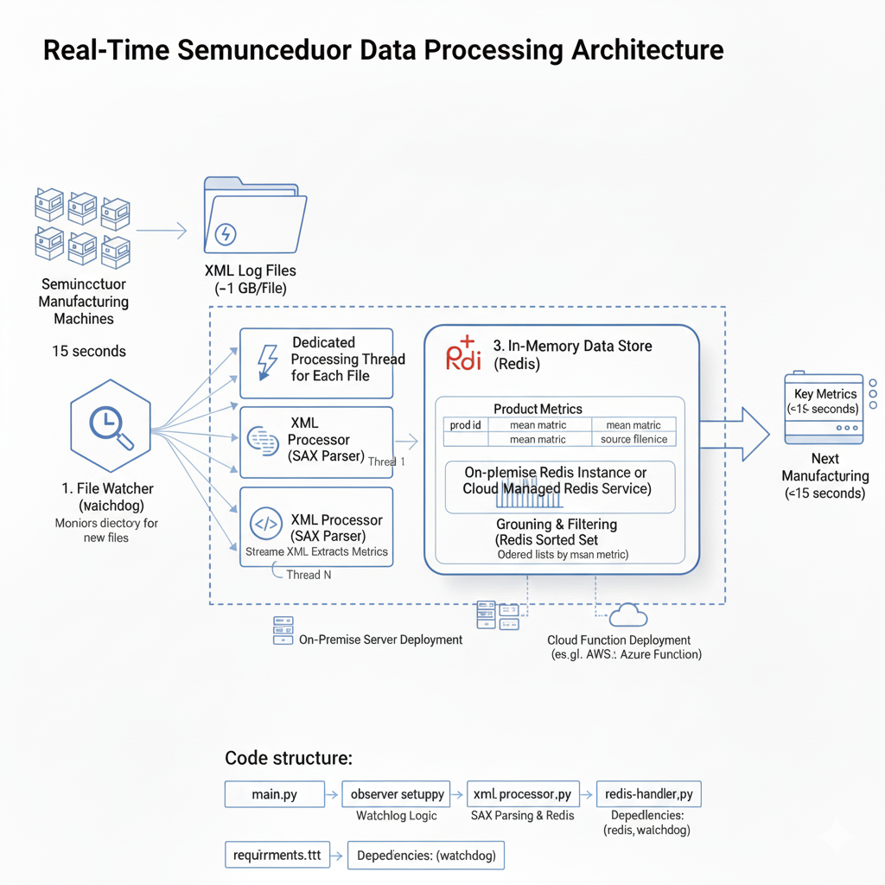

# Real-Time Semiconductor Data Processing

## Problem Statement
In a semiconductor manufacturing facility, products move along an assembly line with various machines. Each machine produces a **~1 GB XML log file** for every scan. Then in **15 seconds** the batch of products move to the next machine.

The challenge is to process these large XML files and provide **key metrics** to the next machine **within this 15-second window**.

---

## Constraints & Key Challenges
- **Low Latency:** Must process each ~1 GB file within **15 seconds**.
- **High Volume:** Up to **200 files/hour per machine**.
- **Large File Size:** Traditional XML parsers (e.g., DOM) are too slow and memory-intensive.
- **Low-Latency Architecture:** Requires a **streaming, in-memory approach**. Can run **on-premise or in specialized cloud setups**.

---

## Architectural Overview
The solution is designed as a **modular, low-latency data processing pipeline**. Key design choices include **streaming XML processing** and **in-memory storage** to avoid bottlenecks.



## Key Performance Requirements
**Solid-State Drives (SSDs):** The machine running this process must use an SSD. The I/O (Input/Output) speed of reading a 1 GB file is a major bottleneck. A high-speed NVMe SSD is recommended.

**Sufficient I/O Bandwidth:** The underlying hardware and network infrastructure must support the high-speed reads required to pull the 1 GB file from disk into memory quickly, ensuring we don't starve the CPU while waiting for data.
---

## Core Components

### 1. File Watcher (Observer Setup)
- **Technology:** [watchdog](https://pypi.org/project/watchdog/) library
- **Role:** Monitors a directory for new XML files. Each file triggers a **dedicated processing thread** for immediate handling.

### 2. XML Processor (SAX Parser)
- **Technology:** `xml.sax` (Python Standard Library)
- **Role:** Processes XML files as a **stream**, while triggering events for tags so we can extract metrics on the fly. Calculates the **mean metric** for each product while reading sequentially.

### 3. In-Memory Data Store (Redis)
- **Technology:** Redis (on-premise instance)
- **Roles:**
  - **Product Metrics:** Stores the mean metric and source filename per `prod_id` in a Redis Hash for quick lookup.
  - **Grouping & Filtering:** Uses a Redis Sorted Set to maintain **real-time ordered lists** of products based on mean metrics, enabling quick queries (e.g., all products with mean < 10).

---

## Code Structure
- `main.py` – Entry point; initializes Redis and starts the file watcher.
- `observer_setup.py` – Contains logic for the watchdog observer.
- `xml_processor.py` – Core logic for parsing XML and storing results in Redis.
- `redis_handler.py` – Manages Redis connections.
- `requirements.txt` – Lists all dependencies (`redis`, `watchdog`) for easy installation.

---

## How to Run

### 1. Clone the Repository
```
    git clone Analysing-xml-data-in-real-time
    cd Analysing-xml-data-in-real-time
```

###  2. Install Dependencies
```pip install -r requirements.txt```

### 3. Start a Redis Instance

Ensure you have a Redis instance running locally (or at the configured REDIS_HOST).

### 4. Run the Script
```python main.py```

# Alternative Solutions to Consider

Below are several alternative approaches that could be evaluated for improved performance or scalability.

---

## 1. Switch to **lxml** for Faster Stream Parsing
Instead of using `xml.sax`, we could adopt the **lxml** library.
- **Why**: lxml is built on top of C-based libraries (`libxml2`), making it significantly more efficient and faster compared to Python’s pure-SAX implementation.
- **Benefit**: Achieves better performance with minimal code changes while still supporting streaming-style parsing.

---

## 2. Fundamental Architectural Shift: Use a Message Queue
We could rethink the initial data generation model.
- **How it works**:
  - Instead of machines writing large 1 GB XML files, they publish individual XML records directly to a central **message queue** like **Apache Kafka**.
  - A downstream processing engine (e.g., Apache Flink or a Kafka consumer) processes metrics in real time.

- **Benefits**:
  - Transforms the workflow from batch-based to **real-time streaming**.
  - Provides a **scalable, fault-tolerant, and robust** architecture for continuous analytics.

---

## 3. "Shred and Process" with Command-Line Tools
This approach separates parsing from calculation, leveraging optimized tools at each stage.

- **Step 1 – Shred the XML**:
  Use a tool like **xmlstarlet** to quickly convert XML into a tabular **CSV** format.
  - Runs extremely fast since `xmlstarlet` is a compiled C program.

- **Step 2 – Process the CSV**:
  Load the CSV into an in-process analytics engine like **DuckDB**.
  - Perform aggregations with familiar **SQL queries**.
  - Push the final metrics to **Redis** for downstream consumption.
---
